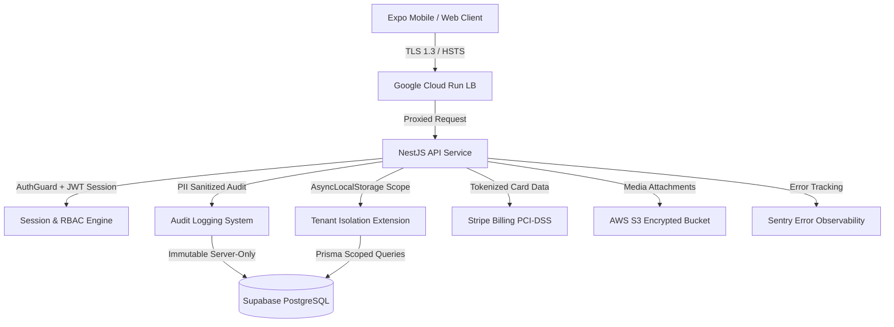

# Venue Wrangler SOC 2 Compliance Program

## Overview

Venue Wrangler is committed to the highest standards of data security, availability, confidentiality, and privacy. This directory contains the formal governance policies, technical architectures, and control matrices that form Venue Wrangler's **SOC 2 Type I and Type II** compliance program adhering to the **AICPA Trust Services Criteria (TSC)**.

---

## Trust Services Criteria in Scope

| Trust Services Criteria | Scope for Venue Wrangler | Description |
|-------------------------|--------------------------|-------------|
| **Security (Common Criteria - CC)** | Mandatory | Firewalls, vulnerability management, access controls, multi-tenant isolation, immutable audit logging, and encryption. |
| **Availability (A)** | Included | 99.9% target uptime, Cloud Run multi-zone auto-scaling, automated database backups, Point-in-Time Recovery (PITR), and disaster recovery drills. |
| **Confidentiality (C)** | Included | Strict tenant data segregation, role-based access control, confidential POS & employee data handling, and encryption at rest and in transit. |
| **Privacy (P)** | Addressed | PII scrubbing, consent policies, data retention schedules, and "Right to be Forgotten" account erasure procedures. |

---

## Policy & Governance Library

The following formal policies govern operations at Venue Wrangler:

1. **[SOC 2 Controls Matrix](./soc2-controls-matrix.md)**: Detailed mapping of AICPA TSC criteria (CC1.1–CC9.2, A1.1–A1.3, C1.1–C1.2) to technical controls in the Venue Wrangler codebase and infrastructure.
2. **[Information Security Policy (ISP)](./information-security-policy.md)**: Master security charter establishing organizational security responsibilities, asset protection, and acceptable use.
3. **[Access Control & Authentication Policy](./access-control-policy.md)**: Rules for user authentication, password complexity, session revocation, and least privilege access.
4. **[Incident Response Plan (IRP)](./incident-response-plan.md)**: Severity levels, triage protocols, incident runbooks, and customer breach notification timelines.
5. **[Business Continuity & Disaster Recovery (BC/DR)](./business-continuity-disaster-recovery.md)**: RTO (4 hours) / RPO (1 hour) targets, Supabase backups, PITR recovery drills, and rollback runbooks.
6. **[Vendor Management Policy](./vendor-management-policy.md)**: Evaluation, monitoring, and annual risk assessment for all cloud subprocessors (GCP, Supabase, Stripe, Sentry, AWS).
7. **[Data Retention & Disposal Policy](./data-retention-disposal-policy.md)**: Data classification, retention lifecycles, and secure data sanitization workflows.
8. **[Prowler Continuous Compliance Guide](./prowler-guide.md)**: Open-source automated SOC 2 and CIS Benchmark scanning across GCP and AWS infrastructure.

---

## Technical Security Architecture Summary

### Key Technical Controls
* **Tenant Isolation**: AsyncLocalStorage tenant context enforced across Prisma queries with database Row-Level Security (RLS) fail-closed backstop ([`docs/tenant-isolation.md`](../tenant-isolation.md)).
* **Audit Trail**: Dedicated `AuditLog` table capturing authentication, authorization, role modifications, and administrative operations with automatic PII redaction.
* **Network & Header Security**: `Strict-Transport-Security` (HSTS), `X-Frame-Options: DENY`, `X-Content-Type-Options: nosniff`, and origin-validated CORS.
* **Continuous Testing & Scans**: Automated GitHub Actions running CodeQL static security analysis, dependency vulnerability gates (`npm audit`), end-to-end tenant isolation integration tests, and **Prowler SOC 2 cloud infrastructure scans** ([`.github/workflows/prowler-compliance.yml`](../../.github/workflows/prowler-compliance.yml)).

---

## Continuous Compliance Automation

Venue Wrangler integrates continuous compliance monitoring via open-source **Prowler** automation and GitHub Actions ([`docs/soc2/prowler-guide.md`](./prowler-guide.md)):
* **GitHub**: Branch protection, PR review enforcement, Dependabot / CodeQL static analysis results.
* **Google Cloud Platform**: Automated weekly Prowler SOC 2 scans of Cloud Run, IAM least-privilege, and Cloud Logging.
* **Supabase / AWS**: Automated S3 backup lifecycle, bucket encryption checks, and network isolation tests.
* **Identity & HR**: Access review schedules, device encryption verification, and annual security training checklists.
