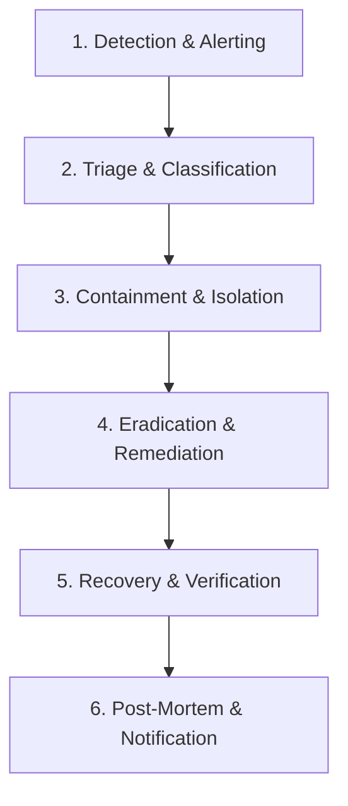

# Security Incident Response Plan (IRP)

**Document Owner**: Security Lead & On-Call Engineering  
**Effective Date**: August 2026  
**Review Cycle**: Semi-Annual  

---

## 1. Objective & Scope

The purpose of this plan is to establish a clear, structured procedure for detecting, triaging, containing, mitigating, and documenting security incidents that affect Venue Wrangler's customer data, cloud infrastructure, or mobile applications.

---

## 2. Incident Classification & Severity Matrix

| Severity | Definition | Examples | SLA to Initial Response | Target Resolution |
|----------|------------|----------|-------------------------|-------------------|
| **SEV-1 (Critical)** | Active data breach, unauthorized access to customer databases, complete service outage, or compromised cloud root credentials. | SQL injection exploit, exposed production DB, active ransomware, API unauthenticated data exposure. | **< 15 minutes** | **< 4 hours** |
| **SEV-2 (High)** | Severe vulnerability actively exploitable, partial service outage, POS secret compromise, or elevated role privilege bypass. | Tenant isolation bypass flaw discovered, POS key leak, auth bypass on non-admin routes. | **< 30 minutes** | **< 12 hours** |
| **SEV-3 (Medium)** | Moderate security issue with compensating controls, localized denial of service, rate limit bypass. | Brute force bypass on non-critical endpoint, dependency with published high CVE but no active exploit. | **< 2 hours** | **< 48 hours** |
| **SEV-4 (Low)** | Informational or low-risk vulnerability, minor security enhancement, failed automated scan anomaly. | Low-severity package advisory, minor security header misconfiguration. | **< 24 hours** | **Next Sprint** |

---

## 3. Incident Response Workflow



### Phase 1: Detection & Alerting
* Automated GCP Cloud Run 5xx alerts, Sentry exception triggers, or reports to `security@venuewrangler.com` / `support@venuewrangler.com`.
* On-call engineer acknowledges alert and opens a dedicated Incident Channel (`#incident-YYYYMMDD-[topic]`).

### Phase 2: Triage & Classification
* Incident Commander assesses scope, affected tenants, and sets severity level (SEV-1 to SEV-4).
* Technical leads are assembled.

### Phase 3: Containment & Isolation
* For compromised credentials: Revoke API keys, rotate POS webhook secrets, terminate active user sessions via `DELETE FROM "Session"`.
* For container/code vulnerabilities: Route Cloud Run traffic back to last known-good revision immediately:
  ```bash
  gcloud run services update-traffic venue-wrangler-api --to-revisions=LAST_KNOWN_GOOD_REV=100 --region=us-east1 --project=venuewrangler
  ```
* For database attacks: Restrict Supabase database connections to authorized backend CIDRs.

### Phase 4: Eradication & Remediation
* Root cause analysis (RCA) performed.
* Patch developed, reviewed by at least one engineer, validated via CI test suites, and deployed to production.

### Phase 5: Recovery & Verification
* Verify `/api/health`, authenticated routes, and database integrity.
* Monitor traffic metrics for anomalous behavior.

### Phase 6: Post-Mortem & Customer Notification
* **Blameless Post-Mortem**: Document timeline, root cause, impact, and action items within 48 hours.
* **Customer Breach Notification**: In the event of confirmed unauthorized access to customer Personal Identifiable Information (PII) or confidential business records, affected customers and regulatory bodies will be notified in writing within **72 hours** of breach confirmation, in accordance with applicable laws (GDPR, state privacy regulations).
