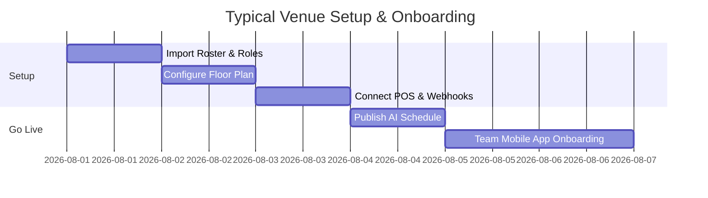

# Venue Wrangler — All-in-One Hospitality Management Platform
## Client Sales Presentation Deck

---

> **Executive Pitch**: Venue Wrangler replaces 5+ disconnected subscriptions (scheduling, reservations, CRM/events, inventory, timekeeping, and team chat) with one unified, state-of-the-art hospitality management system built for restaurants, bars, nightlife venues, and event spaces.

---

```carousel
# SLIDE 1: Platform Overview & Ecosystem

### Venue Wrangler: The Hospitality Command Center
Traditional hospitality tech forces venue owners to string together disparate point solutions that don't speak to each other. Venue Wrangler solves this by unifying front-of-house, back-of-house, and sales operations into a single real-time engine.

#### Core Modules at a Glance:
1. **Workforce & AI Scheduling** (replaces 7shifts / HotSchedules)
2. **Floor Plan & Table Management** (replaces OpenTable / Resy)
3. **Reservations & Cover Pacing** (replaces SevenRooms / Tock)
4. **Event Sales & BEO CRM** (replaces Tripleseat / Gather)
5. **Bar Inventory & Prep Board** (replaces BevSpot / Marginedge)
6. **Geofenced Timekeeping & Payroll** (replaces Homebase / TSheets)
7. **Operations Logbook & Command Center** (replaces Jolt / ZipChecklist)
8. **Team Chat & Role Channels** (replaces Slack / 7shifts Messenger)

<!-- slide -->

# SLIDE 2: Workforce Management & AI Scheduling

### How It Functions
- **AI Auto-Scheduling Engine**: Generates balanced weekly schedules based on employee availability, role qualifications, and labor target hours (`weeklyLaborBudgetHours`).
- **Availability Lock Windows**: Staff submit weekly availability that automatically locks before schedule creation unless unlocked by management (`availabilityUnlocked`).
- **Shift Swaps & Drops**: Peer-to-peer shift swaps require dual acceptance and optional manager review, instantly updating published schedules and notify staff via push.
- **Labor Forecast & Budgeting**: Calculates live sales-per-labor-hour (SPLH) to prevent overstaffing during slow shifts.

### Competitor Comparison: Scheduling
| Feature | 7shifts / HotSchedules | Homebase / Sling | **Venue Wrangler** |
| :--- | :--- | :--- | :--- |
| **AI Schedule Auto-Gen** | ⚠️ Add-on / Basic | ❌ Manual templates | ✅ **Built-in multi-constraint AI** |
| **Live Sales-per-Labor Ratio** | ⚠️ Requires high tier | ❌ None | ✅ **Built-in real-time POS sync** |
| **Peer-to-Peer Shift Swaps** | ✅ Yes | ✅ Yes | ✅ **Built-in with auto-chat links** |
| **Availability Lock Window** | ❌ Basic static | ❌ Static | ✅ **Configurable per pay-period** |

<!-- slide -->

# SLIDE 3: Interactive Floor Plan & Table Seating

### How It Functions
- **Drag-and-Drop Floor Layout Editor**: Managers design exact visual layout dimensions, sections (Main Floor, Patio, VIP, Bar), and custom table shapes (Round, Square, Rect, Booth).
- **Real-Time Table State Machine**: Live color-coded status tracking (`available`, `seated`, `dirty`, `reserved`, `held`, `out_of_service`).
- **Dynamic Table Merging & Splitting**: Combine adjacent tables into a single merge group for large parties with custom minimum spend enforcement (`minSpend`).
- **Server Section Assignment**: Assign waiters to specific floor sections and monitor active covers per server in real time.

### Competitor Comparison: Floor Management
| Feature | OpenTable / Resy | TouchBistro / Toast | **Venue Wrangler** |
| :--- | :--- | :--- | :--- |
| **Visual Floor Editor** | ✅ Yes | ⚠️ Basic POS layout | ✅ **High-res custom layout editor** |
| **Dynamic Table Merging** | ⚠️ Complex setup | ❌ Manual check merge | ✅ **Instant 1-tap table merging** |
| **Server Section Balancing** | ⚠️ High subscription | ❌ Basic | ✅ **Live cover load per server** |
| **BEO Event Auto-Blocking** | ❌ No link to CRM | ❌ None | ✅ **Auto-blocks floor from BEOs** |

<!-- slide -->

# SLIDE 4: Reservations & Kitchen Cover Pacing

### How It Functions
- **Multi-Channel Reservation Ingestion**: Accepts direct online bookings, walk-ins, phone reservations, and external integrations (OpenTable, Resy, SevenRooms, Tock, Google Reserve).
- **15-Minute Cover Pacing Algorithm**: Buckets total booked covers in 15-minute intervals against maximum kitchen/seating capacity to prevent kitchen bottlenecks.
- **Guest Preference Autofill**: Auto-populates guest history on phone/email entry (favorite table, preferred server, dietary allergies, last party size, lifecycle stage).
- **Reservation Hold Blocks**: Allows managers to block date/time windows for buyout events, staff meetings, or deep cleaning with conflict warnings.

### Competitor Comparison: Reservations
| Feature | OpenTable | SevenRooms | **Venue Wrangler** |
| :--- | :--- | :--- | :--- |
| **Cover Commission Fees** | ❌ High per-cover fees ($1-$2.50) | ✅ Flat rate | ✅ **$0 Per-cover commission fees** |
| **15-Min Cover Pacing** | ⚠️ Basic slot caps | ✅ Yes | ✅ **Built-in kitchen load pacing** |
| **Guest Preference Memory** | ⚠️ Basic notes | ✅ Deep CRM | ✅ **Auto-populates guest history** |
| **Direct Webhook Ingestion** | ❌ Walled garden | ⚠️ Limited API | ✅ **Open Webhook Ingest API** |

<!-- slide -->

# SLIDE 5: Event Sales, BEOs, & Contracts (CRM)

### How It Functions
- **Weighted Sales Pipeline**: Manages private event inquiries from initial contact to proposal, contract, and execution with probability-weighted pipeline revenue.
- **1-Click BEO Generation**: Captures F&B minimums, deposit due dates, room setup styles, and itemized menu packages (appetizers, entrees, desserts, bar).
- **Instant Contract & E-Signatures**: Converts BEOs into legal contracts with custom clauses, payment schedules, and client digital signature capturing.
- **Automated Operations Hand-Off**: Confirmed BEOs instantly reserve the floor plan space and generate an **Event Execution Workspace** with timelines and vendor checklists.

### Competitor Comparison: Event CRM
| Feature | Tripleseat / Gather | Salesforce / HubSpot | **Venue Wrangler** |
| :--- | :--- | :--- | :--- |
| **Dedicated BEO Engine** | ✅ Yes | ❌ Requires custom dev | ✅ **Built-in 1-click BEO builder** |
| **Auto Floor Plan Block** | ❌ Separate systems | ❌ None | ✅ **Automatic table & space block** |
| **E-Signatures & Contracts** | ✅ Yes | ⚠️ Requires DocuSign | ✅ **Built-in contract e-signatures** |
| **Staffing & Prep Sync** | ❌ No labor link | ❌ None | ✅ **Auto-creates prep & shift tasks** |

<!-- slide -->

# SLIDE 6: Bar Inventory, AI Ingestion, & Prep Board

### How It Functions
- **AI-Assisted Inventory Parsing**: Upload a photo or paste a text invoice to automatically parse item names, quantities, categories (spirit, wine, beer, mixer), and unit costs.
- **Usage Velocity & Days-Until-Empty**: Tracks item consumption velocity over 4-week rolling windows to calculate exact days-until-empty for every bottle.
- **30-Day Shrinkage & Waste Tracking**: Logs counts, comps, waste, and transfers with financial loss calculations (alerting managers on loss $> \$50$).
- **Kitchen & Bar Prep Board**: Digital kanban board for prep items and 86'd ingredients linked to daily brief operational updates.

### Competitor Comparison: Bar Inventory
| Feature | BevSpot / Craftable | Marginedge / Partender | **Venue Wrangler** |
| :--- | :--- | :--- | :--- |
| **AI Invoice & Photo Parsing** | ⚠️ Add-on feature | ✅ Yes | ✅ **Built-in AI vision & text parser** |
| **Usage Velocity Forecasting** | ⚠️ Basic reports | ⚠️ Complex setup | ✅ **Automatic days-until-empty** |
| **Shrinkage & Waste Alerts** | ✅ Yes | ✅ Yes | ✅ **Auto-alerts on high-value loss** |
| **Prep Board Integration** | ❌ Inventory only | ❌ None | ✅ **Built-in kitchen prep kanban** |

<!-- slide -->

# SLIDE 7: Geofenced Timekeeping & Anti-Fraud Punching

### How It Functions
- **GPS Geofence Validation**: Validates employee lat/lng coordinates against venue boundary radius before allowing clock-in.
- **Mock Location & Fraud Detection**: Rejects GPS spoofing, mocked locations, or out-of-bounds punches.
- **Early Clock-In Windows**: Prevents unscheduled overtime by blocking clock-ins earlier than configured window (e.g. 10 minutes prior).
- **Break Compliance & Payroll Export**: Automatically calculates paid vs. unpaid breaks and exports clean CSV summaries for ADP, Gusto, or Paychex.

### Competitor Comparison: Timekeeping
| Feature | Homebase / TSheets | 7shifts Time Clock | **Venue Wrangler** |
| :--- | :--- | :--- | :--- |
| **GPS Geofencing** | ✅ Yes | ✅ Yes | ✅ **Built-in radius geofence** |
| **Anti-Spoof / Mock Detection** | ⚠️ Basic | ❌ None | ✅ **Strict mock-location rejection** |
| **Early Punch Locking** | ✅ Yes | ✅ Yes | ✅ **Configurable early window** |
| **Manager Overtime Alerts** | ⚠️ Add-on tier | ✅ Yes | ✅ **Real-time 10+ hr shift alerts** |

<!-- slide -->

# SLIDE 8: Operations Command Center & Digital Logbook

### How It Functions
- **Shift Handoff Logbook**: Managers record shift notes, weather conditions, sales summaries, and pinned announcements visible across shift transitions.
- **Photo-Verified Checklists**: Opening, mid-day, and closing checklists with optional mandatory photo capture verification for quality control.
- **Event Command Center**: Multi-timeline task tracker for high-stakes banquets and weddings with vendor status and incident logging.
- **Daily Brief & Profitability Alerts**: Synthesizes shift performance, sales-per-labor-hour alerts, and priority action items.

### Competitor Comparison: Operations & Checklists
| Feature | Jolt / Zip Checklist | Red Book / Pen & Paper | **Venue Wrangler** |
| :--- | :--- | :--- | :--- |
| **Photo Proof Verification** | ✅ Yes | ❌ None | ✅ **Built-in photo upload proof** |
| **Event Timeline Execution** | ❌ Checklist only | ❌ Manual binders | ✅ **Multi-stage event autopilot** |
| **Shift Handoff Logbook** | ⚠️ Separate app | ⚠️ Physical book | ✅ **Digital pinned logbook** |
| **POS & Labor Context** | ❌ No data links | ❌ None | ✅ **Embedded live sales data** |

<!-- slide -->

# SLIDE 9: Contextual Team Messaging & Announcements

### How It Functions
- **Auto-Generated Role Channels**: Automatically creates and maintains role-specific channels (`#Role - Server`, `#Role - Bartender`, `#Role - Kitchen`) populated by active roster profiles.
- **Auto-Generated Shift Crew Channels**: Creates daily shift channels (`#Crew - Friday (Jul 31)`) containing only the staff scheduled for that day.
- **Direct Messaging & Group Chats**: Instant 1-on-1 DMs and custom group messaging with media attachment support and emoji reactions.
- **Shift & Swap Attachments**: Embed specific shifts or swap requests directly inside chat threads for 1-tap manager approval.

### Competitor Comparison: Communication
| Feature | Slack / Teams | 7shifts Messenger | **Venue Wrangler** |
| :--- | :--- | :--- | :--- |
| **Auto Shift-Crew Channels** | ❌ Manual groups | ❌ Basic general chat | ✅ **Auto-created daily shift chats** |
| **Auto Role-Based Channels** | ❌ Manual management | ⚠️ Basic groups | ✅ **Auto-synced by job title** |
| **Embed Shifts / Swaps in Chat** | ❌ None | ⚠️ Basic link | ✅ **Native 1-tap interactive cards** |
| **No Per-User License Fees** | ❌ $8-$15/user/mo | ✅ Included in tier | ✅ **Unlimited team members** |

<!-- slide -->

# SLIDE 10: Value Proposition & ROI Summary

### The Venue Wrangler Financial Advantage

#### 1. Software Consolidation Savings
- Replaces 7shifts ($150/mo) + OpenTable ($249/mo + cover fees) + Tripleseat ($250/mo) + BevSpot ($150/mo) + Homebase ($80/mo) = **$879+/month saved**.

#### 2. Elimination of Per-Cover Commission Fees
- Zero per-cover charges on reservations saves **$500 – $2,500/month** compared to OpenTable or Resy.

#### 3. Labor & Inventory Loss Prevention
- Real-time sales-per-labor monitoring prevents overstaffing (**2-4% reduction in total labor cost**).
- Automated waste and shrinkage alerts prevent high-value liquor loss.



---
*Generated for Client Sales Presentations · Venue Wrangler Platform Version 0.1.0*
````
